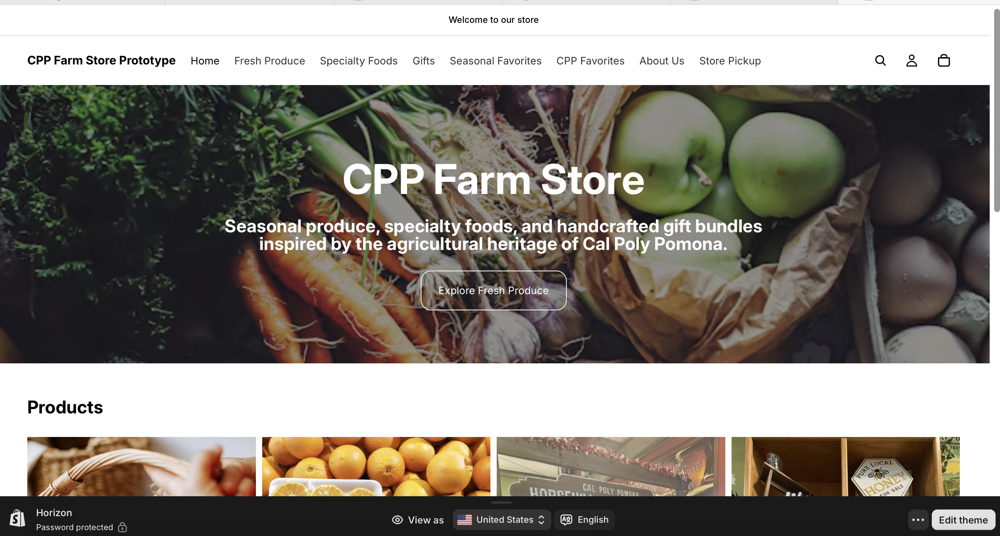
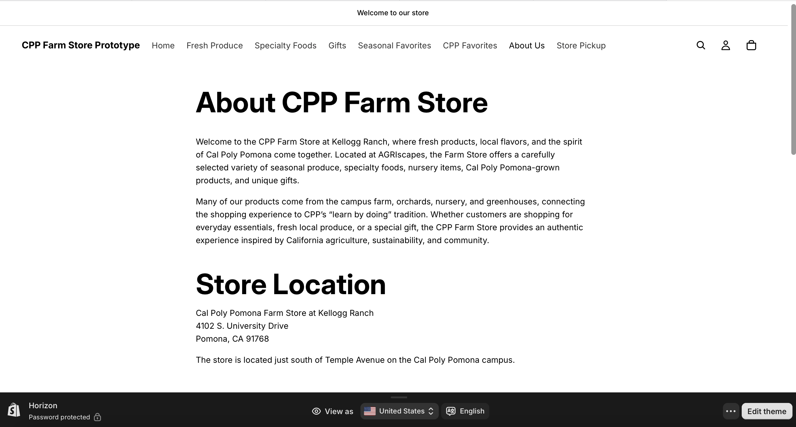
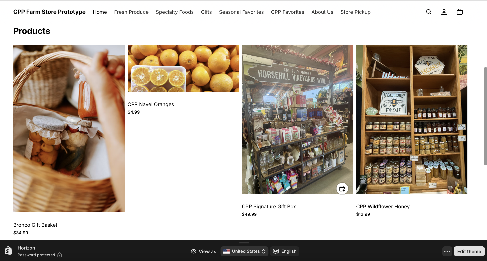
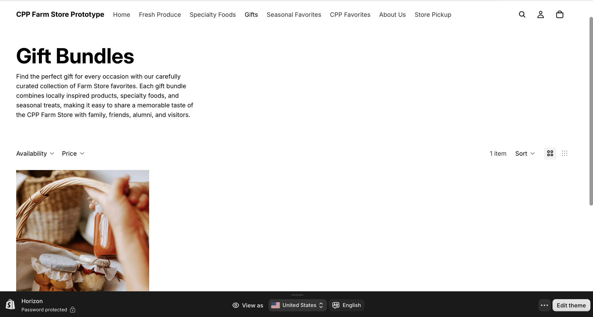
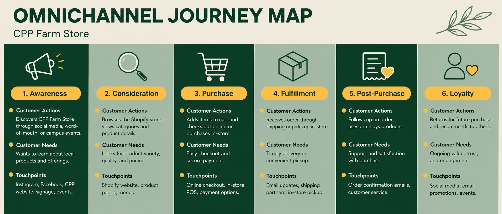

# Shopify Store Preview Link & Screenshots

<https://cpp-farm-store-prototype.myshopify.com>

# Homepage Screenshot

# Navigation/Menu Screenshot

# Product/Collection Examples

# Target Customer

The target customer for the CPP Farm Store is someone who is looking for thoughtful, local, and a convenient gift, like the gift basket. While the farm store also serves CPP students, staff, alumni, and the local community, for the purpose of the Farm Store's goal of increasing gift basket sales, the online store should really highlight how special the gift baskets are.

One key customer is the a buyer who has a connection to Cal Poly Pomona. This includes alumni, parents of students, staff, current students, and any campus visitor who wants to purchase a gift that feels connected to Cal Poly Pomona. These customers may buy gift baskets for holidays, birthdays, thank you gifts, care packages, graduation, or any special on campus event. For these customers, the value of the gift basket is not just the products that are included in the basket, but the connection to CPP and the local farm store experience.

Another key target customer would be the local community shopper who values fresh, high quality, and locally inspired products. This customer may be interested in home-grown goods such as fruits, vegetables, honey, and other CPP branded items that feel different and more natural than those found at the local grocery store. A gift basket makes these items easier to buy because it packages them into a ready-to-give option.

Overall, the ideal customer for the CPP Farm Store values convenience, freshness presentation, and meaning. They may visit the Farm Store for regular grocery shopping, but the online store can also encourage them to see the farm store as a place to buy thoughtful gifts. By highlighting gift baskets alongside fresh produce, snacks, specialty foods, and CPP branded products, the shopify mini store can support both everyday shopping and special occasion purchases as well like the gift basket.

# E commerce Strategy

::: callout-important
**Purpose of the prototype:** Show how CPP Farm Store can extend its in-person retail experience online, with two goals:

-   A centralized inventory model so stock isn't tracked twice between in-store and online

-   A self-service gift basket experience customers can browse and build without staff help
:::

## Gift basket structure (hybrid model):

-   **Curated baskets:** fixed pre-built options ("Fall Harvest," "CPP Grad Gift," "Faculty Welcome Basket") for customers who want a quick, no-decisions purchase

-   **Build-your-own:** customer selects a base size/container, then adds or swaps items from a defined "basket-eligible" product set (not the full catalog)

## Inventory approach (component-level):

-   Every basket, whether curated or custom, is a collection of individual SKUs (jam, honey, produce, tote, etc.) drawing from the same stock pool as items sold standalone

-   Selling one jar of honey in a basket and one sold on its own both deduct from the same count (no double-tracking)

## Platform & Tech

-   **Payment gateway:** Shopify Payments as default

-   **Checkout & mobile:** Standard Shopify checkout; mobile-first layout given likely on-the-go/student browsing behavior

-   **Shipping/fulfillment:** Local delivery and in-store pickup are primary fulfillment methods

-   **Navigation:** Fresh Produce · Gift Baskets · Build Your Own Basket · Seasonal Items · CPP Favorites · Store Pickup · About

-   **Homepage:**

    -   Featured seasonal products or basket themes

    -   Clear CTA: "Shop Gift Baskets" / "Build Your Own" / "Order for Pickup"

-   **Gift basket page (core interaction):**

    -   Curated baskets displayed as standard products (image, description, price, CTA)

    -   "Build Your Own" flow: pick container size → select/swap items from eligible set → live price update → add to cart

    -   Availability should reflect real component stock (e.g. disable an item if its inventory is out)

## Content & SEO

-   Product/basket descriptions should be customer-oriented: what it is, who it's for, why it's appealing (e.g. "Great for move-in gifts" for a student audience)

## Marketing & Acquisition

-   Simple seasonal landing pages tied to basket themes featured on social media and in newsletter

-   Email/SMS capture at cart and checkout, with abandoned cart flow

# Connection to Omnichannel Journey Map

The CPP Farm Store Shopify prototype supports an omnichannel customer journey by providing a seamless shopping experience across both digital and physical channels. Customers can discover the Farm Store through social media, search engines, or the Cal Poly Pomona website and then browse products online before deciding to visit the physical store or purchase online.

The homepage highlights featured collections such as fresh produce, specialty foods, gifts, and seasonal favorites, making it easy for customers to explore products based on their interests. The navigation menu organizes products into clear categories, reducing the effort required to find items and improving the browsing experience.

As customers move through the journey from awareness and consideration to purchase, the Shopify store provides consistent branding and product information. Whether customers shop online or visit the Farm Store in person, they encounter the same product categories, promotions, and branding, creating a connected experience across channels.

Overall, the Shopify prototype strengthens the omnichannel strategy by integrating the online storefront with the physical Farm Store, helping customers transition smoothly between discovering products, exploring offerings, and completing a purchase.

# Appendix

-   [GitHub Repo](https://github.com/lewiswaddell/GP2.git)

-   GitHub Page
